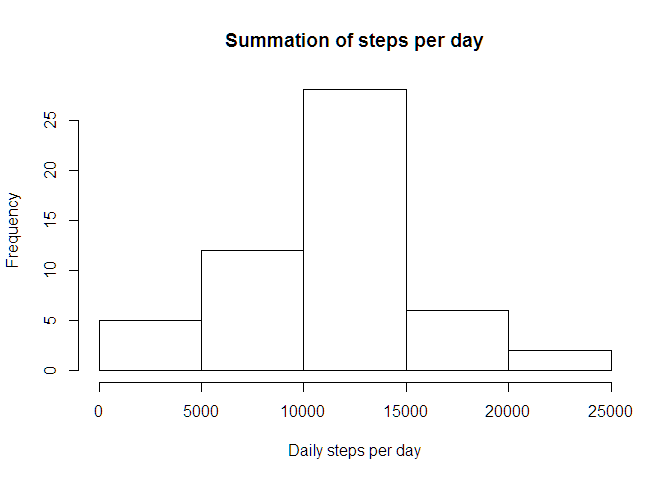
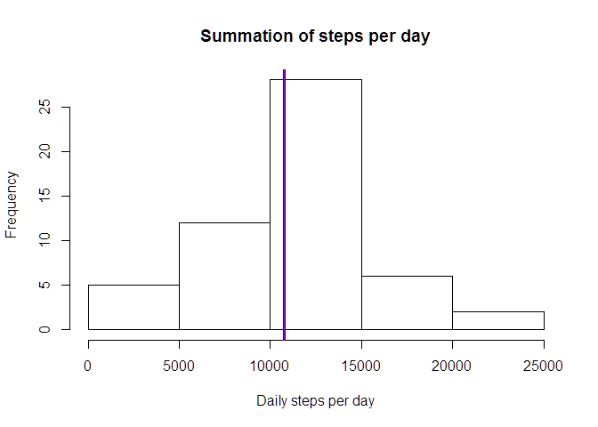
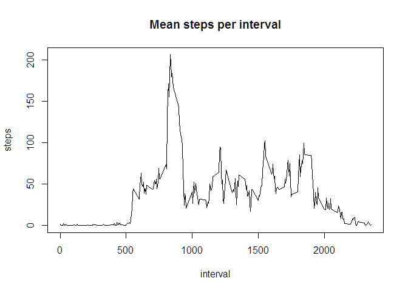
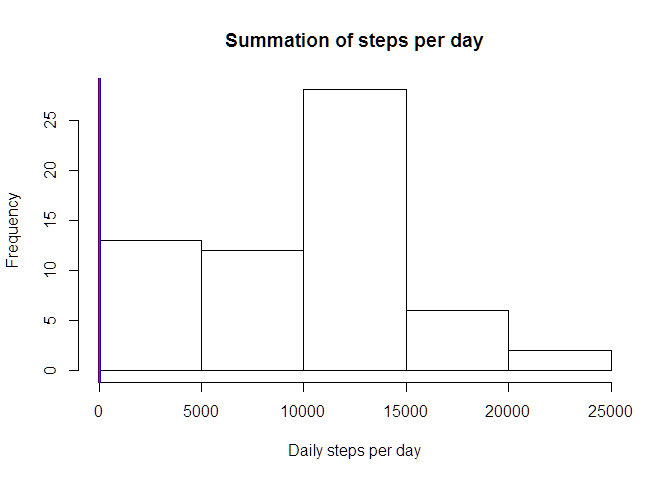
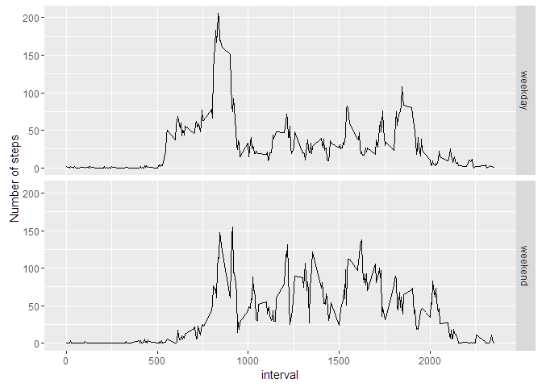

# Reproducible Research: Peer Assessment 1
Gavin Kim  


## Load packages used in code

```r
# Set locale for datetime funtions
Sys.setlocale("LC_TIME", "English")
```

```
## [1] "English_United States.1252"
```

```r
require("ggplot2")
```

```
## Loading required package: ggplot2
```

```
## Warning: package 'ggplot2' was built under R version 3.3.1
```

```r
require("data.table")
```

```
## Loading required package: data.table
```

```
## Warning: package 'data.table' was built under R version 3.3.1
```

## Loading and preprocessing the data
* Load the data from local zip file named "activity.zip"

```r
activity <- read.csv(unz("activity.zip", "activity.csv"), header = TRUE, na.strings = "NA" )
# Convert date 
activity$date <- as.POSIXct(activity$date)
activity <- data.table(activity)
```

## What is mean total number of steps taken per day?
* Calculate the total number of steps taken per day

```r
plotdata <- aggregate(steps ~ date, 
                      data = activity, 
                      FUN = sum)

# Histogram of daily steps per day
hist(plotdata$steps, xlab = "Daily steps per day", main = "Summation of steps per day")
```

<!-- -->

* Calculate and report the mean and median of the total number of steps taken per day

```r
# Calculate and print mean and median of steps
mean.steps <- mean(plotdata$steps) 
median.steps <- median(plotdata$steps)

sprintf("Mean of steps is %f", mean.steps)
```

```
## [1] "Mean of steps is 10766.188679"
```

```r
sprintf("Median of steps is %i", median.steps)
```

```
## [1] "Median of steps is 10765"
```

```r
# Add a line of mean and median to plot
hist(plotdata$steps, xlab = "Daily steps per day", main = "Summation of steps per day")
abline(v = mean.steps, lwd = 3, col = "blue")
abline(v = median.steps, lwd = 1, col = "red")
```

<!-- -->

## What is the average daily activity pattern?
* 5-minute interval (x-axis) and the average number of steps taken, averaged across all days (y-axis)

```r
mean.plotdata <- aggregate(steps ~ interval, 
                      data = activity, 
                      FUN = mean)

plot(mean.plotdata, type = "l", main = "Mean steps per interval")
```

<!-- -->

* Which 5-minute interval, on average across all the days in the dataset, contains the maximum number of steps?

```r
maxpos.steps <- which.max(plotdata$steps)
sprintf("Max steps of mean across intervals is %f. And the interval is %i", plotdata$steps[maxpos.steps], maxpos.steps)
```

```
## [1] "Max steps of mean across intervals is 21194.000000. And the interval is 47"
```

## Imputing missing values
* Calculate and report the total number of missing values in the dataset

```r
num.na <- sum(is.na(activity$steps))
sprintf("Count of missing value is %i", num.na)
```

```
## [1] "Count of missing value is 2304"
```

* Create new dataset with filled missing values

```r
# My strategy is filling empty data with mean of that interval
median.interval <- data.table(aggregate(steps ~ interval, 
                      data = activity, 
                      FUN = median))

# Actually reference of filledactivity and activity is same
filledactivity <- activity[, steps:=mapply(steps, interval,SIMPLIFY = TRUE, FUN = function(pSteps, pInterval){
  if(is.na(pSteps)) {
    median.interval[interval == pInterval,steps]
  } else {
    pSteps
  }
})]
```

* Make a histogram of the sum/mean/median of steps taken each day

```r
plotdata <- aggregate(steps ~ date, 
                      data = filledactivity, 
                      FUN = sum)

# Calculate and print mean and median of steps
mean.steps <- mean(filledactivity$steps) 
median.steps <- median(filledactivity$steps)

sprintf("Mean of steps is %f", mean.steps)
```

```
## [1] "Mean of steps is 32.999545"
```

```r
sprintf("Median of steps is %i", median.steps)
```

```
## [1] "Median of steps is 0"
```

```r
# Add a line of mean and median to plot
hist(plotdata$steps, xlab = "Daily steps per day", main = "Summation of steps per day")
abline(v = mean.steps, lwd = 3, col = "blue")
abline(v = median.steps, lwd = 1, col = "red")
```

<!-- -->

## Are there differences in activity patterns between weekdays and weekends?
* Create a new factor variable in the dataset with two levels – “weekday” and “weekend” indicating whether a given date is a weekday or weekend day.

```r
filledactivity <- filledactivity[, weekday:=as.factor(sapply(date, FUN = function(pDate){
  if(weekdays(pDate, abbreviate = TRUE) %in% c("Sat", "Sun")) {
    return("weekend")
  } else {
    return("weekday")
  }
}))]
```

* Make a panel plot containing a time series plot (i.e. type = "l") of the 5-minute interval (x-axis) and the average number of steps taken, averaged across all weekday days or weekend days (y-axis).

```r
plotdata <- filledactivity[, mean(steps), by=c("weekday","interval")]

qplot(x = interval, y = V1, data = plotdata, geom = "line", facets = weekday~., ylab = "Number of steps")
```

<!-- -->

